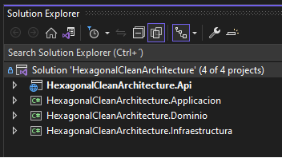
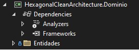

# **Hexagonal Clean Architecture**

## Contexto

Este es un proyecto que he decidido crear como base para las personas que puedan sacar provecho de él, donde cuyo objetivo es ilustrar el trabajo de Clean Architecture junto con la Arquitectura Hexagonal, recordando que Clean Architecture es un enfoque de diseño de software en el cual su principal razón es la separación del dominio de la infraestructura y la arquitectura Hexagonal (también conocida como Puertos y Adaptadores) es en la que nos apalancamos para lograr el objetivo de tener tu lógica de negocio completamente aislado del mundo exterior.

Cuando hablamos de Infraestructura nos estamos refiriendo a conexiones externas como por ejemplo la creación de un archivo de texto hasta conexiones de bases de datos, servicios de mensajería o servicios Web de Terceros.

### **Stack Tecnologico.**

.Net 6

#### **Atributos de Calidad**
  
- Interoperatividad
- Escalabilidad
- Rendimiento

## **Capas de solución**

#### **Api**

Capa en la que encontraremos los Controladores, Program, Filtro de Excepciones y appsettings del proyecto por ambiente.

#### **Aplicacion**

Capa encargada de distribuir la responsabiliad a las capas de negocio o infraestructura para enviar mensaje o comunicación de Api's todo depende de la responsabilidad del servicio.
#### **Dominio**

Capa en la que reposara toda la logica del negocio, validaciones etc. En esta capa **NO** se deben tener conexiones a Bases de datos, servicios Web o ApiRest, la idea es que la comunicación se realice mediante la capa de infraestructura.

Notese como en la Capa de Dominio no cuenta con referencias a ningun proyecto o paquete Nuget.

Recuerda, el dominio no conoce a Nadie es el solo e independiente.

#### **Infraestructura**

Capa en la que encontraremos las conexiones a Base de Datos, Conexiones externas y/o librerias externas que deseemos usar, como por ejemplo Servicios de Mensajeria o librerias de creación de archivos Pdf's o Excel.

## **Autor.**

- [Jhon Alexis Ramirez Triana](www.linkedin.com/in/jaramirezt)

## **Importante:** 
El proyecto se encuentra en construcción y descargo toda responsabilidad de uso.

Fecha de inicio: 4 Abril 2023 >>