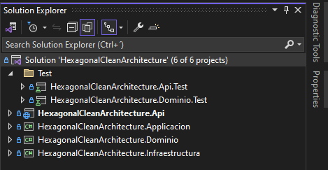

# **Hexagonal Clean Architecture**

## Contexto

Este es un proyecto que he decidido crear como base para las personas que puedan sacar provecho de él, donde cuyo objetivo es ilustrar el trabajo de Clean Architecture junto con la Arquitectura Hexagonal, recordando que Clean Architecture es un enfoque de diseño de software en el cual su principal razón es la separación del dominio de la infraestructura y la arquitectura Hexagonal (también conocida como Puertos y Adaptadores) es en la que nos apalancamos para lograr el objetivo de tener tu lógica de negocio completamente aislado del mundo exterior.

Cuando hablamos de Infraestructura nos estamos refiriendo a conexiones externas como por ejemplo la creación de un archivo de texto hasta conexiones de bases de datos, servicios de mensajería o servicios Web de Terceros.

## **Autor.**

- [Jhon Alexis Ramirez Triana](www.linkedin.com/in/jaramirezt)

### **Stack Tecnologico.**

.Net 6.

PostgreSQL  

#### **Atributos de Calidad**

- Interoperatividad

- Escalabilidad

- Rendimiento

## **Capas de solución**

#### **Api**

Capa en la que encontraremos los Controladores, Program, Filtro de Excepciones y appsettings del proyecto por ambiente.

#### **Aplicacion**

Capa encargada de distribuir la responsabiliad a las capas de negocio o infraestructura para enviar mensaje o comunicación de Api's todo depende de la responsabilidad del servicio.

#### **Dominio**

Capa en la que reposara toda la logica del negocio, validaciones etc. En esta capa **NO** se deben tener conexiones a Bases de datos, servicios Web o ApiRest, la idea es que la comunicación se realice mediante la capa de infraestructura.

Notese como en la Capa de Dominio no cuenta con referencias a ningun proyecto o paquete Nuget.

Recuerda, el dominio no conoce a Nadie es el solo e independiente.

#### **Infraestructura**

Capa en la que encontraremos las conexiones a Base de Datos, Conexiones externas y/o librerias externas que deseemos usar, como por ejemplo Servicios de Mensajeria o librerias de creación de archivos Pdf's o Excel.

#### **Api.Test**

Capa en la que encontramos todo lo relacionado con las pruebas de integración del proyecto, recordemos que la idea de las pruebas de integración es realizar la prueba de punta a punta con todos los componentes que interactuan el endpoint, es decir aqui es donde todos los componentes interactuan de manera integral, bases de datos, volumenes, web services externos etc etc.

Algo que debemos tener presente es que estas pruebas son muy costosas en cuanto a rendimiento, por eso la recomendación es realizar solo el escenario feliz el endpoint.

#### **Dominio.Test**

Capa en la que encontramos todo lo relacionado con las pruebas unitarias del proyecto pero enfocado solo a la capa de dominio.

De acuerdo a la estructura del proyecto toda nuestra logica de la aplicación esta en la capa de dominio, es decir que en estas pruebas ejecutamos todos los escenarios que abarcan los métodos del dominio, por ejemplo: Podemos tener un método donde por una serie de validaciones pueden retornar diferentes excepciones, en este caso para ese solo método debemos ejecutar las 'N*' pruebas que sean necesarias que cubran todos los escenarios.

## **Recursos:**

A continuación relaciono los recursos en los cuales me he basado para la construcción del proyecto.

#### **Manejo de MediaTR para comandos y Querys**
- [MediaTR](https://github.com/jbogard/MediatR)

#### **Filtro de Excepciones**
- [ExceptionFilter](https://nwb.one/blog/exception-filter-attribute-dotnet)

#### **Entity Framework, PostgreSQL**
- [Entity Framework](https://www.npgsql.org/efcore/)

#### **Repositorio generico**
- [GenericRepository](https://learn.microsoft.com/es-es/aspnet/mvc/overview/older-versions/getting-started-with-ef-5-using-mvc-4/implementing-the-repository-and-unit-of-work-patterns-in-an-asp-net-mvc-application#create-a-generic-repository)

#### **Personalización tabla de migración**
- [Migratión](https://learn.microsoft.com/en-us/ef/core/managing-schemas/migrations/history-table)

#### **Entendimiento del Tacking de una entidad**

Este apartado me parece importante incluirlo para que puedan entender porque se configura el tracking en las entidades de la Base de datos
- [Tracking](https://learn.microsoft.com/en-us/ef/core/querying/tracking)

## **Pruebas:**

#### **Entendimiento de Pruebas**

Este apartado me parece importante incluirlo para que puedan tener una introducción a las pruebas y sus tipos de pruebas si no se encuentran familiarizados con el tema
- [Testing](https://learn.microsoft.com/es-es/dotnet/core/testing/)

#### **Actualización de Fechas para postgresql**
- [Fechas en postgresql](https://www.npgsql.org/doc/types/datetime.html)

#### **Pruebas Unitarias**
- [Prueba unitaria de C#](https://learn.microsoft.com/es-es/dotnet/core/testing/unit-testing-with-dotnet-test)

#### **Pruebas de Integración**
- [Pruebas de integración en ASP.NET Core](https://learn.microsoft.com/es-es/aspnet/core/test/integration-tests?view=aspnetcore-6.0)

## **Importante:**

La Fase I del proyecto corresponde a la creación base del proyecto con la que tendremos un CRUD de una entidad conectada a PostgreSQL.

Fecha inicio fase I - 4 Abril 2023

Fecha fin fase I - 23 de Abril 2023

La Fase II del proyecto corresponde a la creación de las pruebas unitarias e integración del proyecto

Fecha fin fase II - 01 de Diciembre 2023

La idea es continuar con Fases posteriores las cuales contemplaran, conexiónes a Azure o Aws (Aun esta pendiente la decisión)